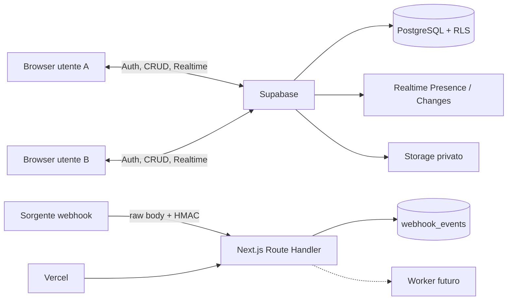

# Aula studio virtuale

MVP di un'aula privata per studiare insieme in tempo reale. È costruito con Next.js,
TypeScript, Tailwind CSS e Supabase (Auth, PostgreSQL, Realtime e Storage).

La struttura non è limitata a due persone, ma l'esperienza è ottimizzata per una coppia
di studio. È presente anche una modalità demo interattiva che non richiede account né
database.

## Avvio rapido

Requisiti:

- Node.js 20.9 o superiore;
- pnpm 9 o superiore;
- un progetto Supabase per account e sincronizzazione reale.

```bash
pnpm install
pnpm dev
```

Aprire `http://localhost:3000`. La demo è disponibile direttamente in
`http://localhost:3000/room/demo` anche senza file `.env.local`.

Per abilitare tutte le funzioni:

```bash
cp .env.example .env.local
```

Su PowerShell:

```powershell
Copy-Item .env.example .env.local
```

Compilare poi `.env.local` con i valori della schermata **Connect** di Supabase:

```dotenv
NEXT_PUBLIC_SUPABASE_URL=https://PROJECT_REF.supabase.co
NEXT_PUBLIC_SUPABASE_PUBLISHABLE_KEY=sb_publishable_...
SUPABASE_SECRET_KEY=sb_secret_...
WEBHOOK_SECRET=una-stringa-casuale-di-almeno-32-caratteri
NEXT_PUBLIC_APP_URL=http://localhost:3000
NEXT_PUBLIC_DEMO_MODE=0
```

La publishable key è progettata per il client. `SUPABASE_SECRET_KEY` e
`WEBHOOK_SECRET` sono esclusivamente server-side e non devono mai avere il prefisso
`NEXT_PUBLIC_`.

## Configurazione Supabase

### 1. Creare e collegare il progetto

Creare un progetto da Supabase e installare la CLI. Dalla radice di questo progetto:

```bash
supabase login
supabase link --project-ref PROJECT_REF
supabase db push
```

`db push` applica in ordine le migrazioni contenute in `supabase/migrations`:

1. tipi, tabelle, vincoli, indici, trigger e funzioni RPC;
2. Row Level Security, privilegi, Realtime e policy Storage.
3. correzione atomica dell'ingresso tramite codice invito;
4. chiamate audio WebRTC e partecipanti invitati;
5. aggiornamenti finali delle chiamate visibili ai partecipanti;
6. fondazione privata per traduzione adattiva e vocabolario.
7. lettore TXT e posizione privata per utente;
8. esecuzione protetta della traduzione;
9. Catalogo e percorsi di Eve;
10. salvataggio controllato di fonti web;
11. risorse e roadmap gratuite;
12. cache dei curriculum;
13. pacchetto editoriale di programmazione;
14. layout modulare e rimozione non distruttiva;
15. workspace interno, classificazione dei materiali e monitoraggio didattico.

In alternativa, incollare i file SQL nell'editor Supabase rispettando lo stesso ordine.

### 2. Autenticazione

In **Authentication → URL Configuration** impostare:

- Site URL locale: `http://localhost:3000`;
- Redirect URL locale: `http://localhost:3000/**`;
- dopo il deploy, aggiungere anche `https://NOME-PROGETTO.vercel.app/**`.

Per una prova immediata si può disabilitare temporaneamente la conferma email. In
produzione è consigliabile lasciarla attiva.

La migrazione crea automaticamente `profiles` quando nasce un record in `auth.users`.
Non inserire profili a mano dall'app.

### 3. Realtime e Presence

La migrazione aggiunge alla publication `supabase_realtime` le tabelle condivise e
imposta `REPLICA IDENTITY FULL` dove serve per ricevere update e delete completi.

Il client usa:

- Postgres Changes per progressi, sessioni, chat, checklist, materiali, note e attività;
- Presence come segnale effimero di connessione e per contare le schede dello stesso
  account;
- la tabella `presence`, aggiornata da RPC autenticata e heartbeat con timestamp server,
  come fonte autorevole di stato e attività;
- una breve finestra di tolleranza prima di mostrare offline.

Se il progetto Supabase è stato creato con impostazioni personalizzate, verificare in
**Database → Replication** che le tabelle previste risultino abilitate.
In **Realtime Settings** disabilitare l'accesso pubblico ai canali: Presence usa canali
privati e le policy su `realtime.messages` ammettono soltanto i membri attivi della stanza.

### 4. Storage

La seconda migrazione crea il bucket privato `study-materials`. Il percorso obbligatorio
è:

```text
<roomId>/<userId>/<uuid>.<estensione>
```

Le policy consentono accesso soltanto ai membri attivi della stanza. L'interfaccia
accetta PDF, TXT, DOCX e PPTX fino a 10 MB e genera nomi non controllati dall'utente.
Per produzione ad alto rischio aggiungere scansione antivirus asincrona.

### 5. Dati demo SQL

`supabase/seed.sql` contiene un set ripetibile per lo sviluppo locale. Il seed SQL è
separato dalla demo frontend: quest'ultima funziona sempre e non scrive nel database.

Per un database Supabase locale:

```bash
supabase db reset
```

Per un progetto remoto è preferibile creare due account reali dall'interfaccia e poi una
stanza, invece di usare identità fittizie.

## Prova con due account

1. Avviare l'app e registrare il primo account.
2. Creare una stanza dalla dashboard e copiare il codice invito.
3. Aprire una finestra privata del browser e registrare il secondo account.
4. Entrare usando il codice.
5. Tenere le due finestre affiancate e cambiare stato, progresso o checklist.
6. Inviare un messaggio e avviare/fermare un timer.
7. Verificare che ogni modifica compaia nell'altra finestra senza refresh.
8. In una terza sessione autenticata ma non membro, provare ad aprire l'URL della stanza:
   RLS deve restituire zero righe e l'app mostra “accesso non autorizzato”.

## Webhook firmato

Endpoint:

```text
POST /api/webhooks/study-update
x-webhook-signature: sha256=<digest-esadecimale>
```

La firma è HMAC-SHA256 calcolata sui byte esatti del corpo. Il route handler:

- legge il raw body (massimo 64 KiB);
- applica un limite base di 30 richieste/minuto per IP/istanza;
- verifica la firma con confronto constant-time;
- valida l'evento con Zod;
- inserisce `event_id` in modo atomico e idempotente;
- risponde `202` dopo l'accodamento, `200` ai duplicati;
- non registra payload, firma o segreti nei log.

### Esempio curl — macOS/Linux

```bash
export WEBHOOK_SECRET='sostituire-con-almeno-32-caratteri'
SIGNATURE=$(node scripts/sign-webhook.mjs examples/progress-updated.json)

curl --request POST 'http://localhost:3000/api/webhooks/study-update' \
  --header 'content-type: application/json' \
  --header "x-webhook-signature: $SIGNATURE" \
  --data-binary '@examples/progress-updated.json'
```

### Esempio curl — PowerShell

```powershell
$env:WEBHOOK_SECRET = 'sostituire-con-almeno-32-caratteri'
$signature = node scripts/sign-webhook.mjs examples/progress-updated.json

curl.exe --request POST "http://localhost:3000/api/webhooks/study-update" `
  --header "content-type: application/json" `
  --header "x-webhook-signature: $signature" `
  --data-binary "@examples/progress-updated.json"
```

Per una firma valida usare nel file JSON `roomId` e `userId` realmente esistenti. Il
webhook accoda l'evento in `webhook_events`; un worker distribuito per elaborazioni
lunghe è esplicitamente separato dalla risposta HTTP.

## Test e controlli

```bash
pnpm test
pnpm typecheck
pnpm lint
pnpm build
```

Oppure:

```bash
pnpm check
```

I test inclusi coprono:

- firma sul raw body, firma errata e secret debole;
- validazione dei payload e limite dimensione;
- deduplicazione concorrente tramite `eventId`;
- rate limiting del webhook;
- normalizzazione e deduplicazione Realtime;
- riconnessione con backoff;
- grace period della Presence;
- buffer di autosalvataggio e payload `user_left_room`;
- RLS su tutte le tabelle, isolamento dei segreti, Storage privato e policy dei canali.
- mastery del vocabolario, ripetizione dilazionata e isolamento RLS dei dati linguistici.

## Aula modulare e rimozione sicura

La stanza usa una barra strumenti con pannelli richiudibili e un'area centrale dominante.
Timer e Chat sono widget flottanti minimizzabili e le preferenze visive restano separate
per utente e stanza. Corsi e materiali possono essere rimossi soltanto dagli utenti
autorizzati, con anteprima dell'impatto, archiviazione transazionale, pulizia Storage
asincrona e aggiornamento Realtime degli altri partecipanti.

La migrazione `0014_modular_room_layout_and_safe_removal.sql` deve essere applicata prima
di pubblicare questa versione. Il comportamento completo, comprese le due modalità di
rimozione di un corso, è documentato in
[`docs/ROOM_LAYOUT_AND_REMOVAL.md`](docs/ROOM_LAYOUT_AND_REMOVAL.md).

## Workspace interno dei materiali

La migrazione `0015_internal_material_workspace.sql` trasforma i materiali da semplici
collegamenti a risorse di studio classificate. Nell'aula, la selezione apre sempre prima
il workspace interno:

- TXT nel lettore privato esistente, con paragrafo, token, traduzioni e ripresa;
- PDF caricati nello Storage privato nel lettore del browser, con pagina e percentuale;
- DOCX come testo estratto sul server senza HTML attivo o macro;
- PPTX come sequenza di slide testuali;
- YouTube, playlist e Vimeo tramite i player ufficiali incorporati;
- file video HTTPS autorizzati tramite player HTML5.

Posizione, intervalli video realmente riprodotti, percentuale e tempo attivo vengono
salvati nella tabella canonica `material_reader_progress`. Il salvataggio avviene ogni
10 secondi, in pausa, quando la pagina viene nascosta, alla chiusura e alla
riconnessione. Un salto alla fine del video non vale come completamento: serve almeno
il 90% di secondi unici riprodotti.

Pagine generiche, esercizi esterni e PDF presenti soltanto come URL sono marcati
`import-required`: l'app propone una risorsa alternativa o il caricamento di una copia
che l'utente è autorizzato a utilizzare. L'apertura esterna resta una scelta secondaria
esplicita e viene indicata come non monitorabile. L'app non aggira CSP, autenticazione,
DRM o condizioni del provider.

Gli eventi sintetici (`material_opened`, `material_resumed`, pause, completamenti e
chiusura) confluiscono in `activity_events`, Realtime e nel riepilogo automatico. Chat,
chiamate, risposte private, traduzioni e vocabolario personale non vengono inseriti nel
riepilogo condiviso.

## Catalogo intelligente con Eve

La route privata `/catalog` consente di cercare materiali reali per materia,
obiettivo, progetto, professione o esame. Eve ordina con regole locali soltanto
i materiali presenti nel database: il Catalogo non effettua chiamate OpenAI e
non consuma credito.

La migrazione `0009_intelligent_catalog.sql` aggiunge tassonomia, catalogo,
preferenze, ricerche private e percorsi. Un percorso può essere importato in una
stanza come corso, materiali e checklist. Per attivare la sezione:

```env
NEXT_PUBLIC_CATALOG_ENABLED=1
CATALOG_ENABLED=true
EVE_CATALOG_ENABLED=false
EVE_WEB_SEARCH_ENABLED=false
EVE_AUTOMATIC_CURRICULUM_ENABLED=false
EVE_CURRICULUM_MODEL=gpt-5.6-sol
EVE_CURRICULUM_TIMEOUT_MS=60000
EVE_SEARCH_INTERPRETATION_ENABLED=false
EVE_PATH_AI_ENABLED=false
```

La barra cerca nel Catalogo oppure apre su Google una ricerca didattica già
preparata. Ogni tappa del percorso include ricerche Google separate per
lezioni, esercizi, video e PDF. I risultati scelti dall'utente possono essere
aggiunti manualmente con un URL HTTPS: vengono deduplicati, restano personali e
sono marcati “da verificare”. Il percorso completo può essere importato in
un'aula come corso, materiali e checklist. `OPENAI_API_KEY` non viene usata
dalle route del Catalogo.

La migrazione `0013_programming_subject_package.sql` aggiunge il primo pacchetto
editoriale modulare: **Programmazione da zero**. Comprende 14 tappe ordinate,
12 fonti curate, ricerche Google italiane e inglesi per ogni tappa e una
checklist strutturata in lezioni, esercizi, progetto e verifica. Il resolver
riconosce anche alias come `coding`, `software development`, `python` e
`diventare programmatore`. L'importazione nella stessa aula è idempotente.
Dettagli tecnici e privacy sono in [`docs/CATALOG.md`](docs/CATALOG.md).

## Traduzione adattiva - fasi 1, 2 e 3

La migrazione `0006_adaptive_vocabulary_foundation.sql` aggiunge preferenze
linguistiche, vocabolario privato, occorrenze, review, prove didattiche e cache
server-only. Le preferenze sono gia disponibili nelle impostazioni della
stanza. La migrazione `0007_material_reader_progress.sql` e la route
`/room/[roomId]/material/[materialId]` attivano il lettore TXT: apertura dentro
l'app, testo selezionabile e posizione privata con autosalvataggio. La selezione
manuale, la traduzione contestuale e l'annotazione sopra la parola sono
operative. Il PDF e le annotazioni adattive automatiche restano fasi
successive; il provider AI si abilita soltanto tramite variabili server-side.

La fase di traduzione contestuale aggiunge `POST /api/translation/translate`,
router deterministico Luna/Terra, cache, vocabolario automatico, limite
giornaliero e registro dei consumi senza testo integrale. Per attivare nuove
chiamate impostare esclusivamente su Vercel/server:

```env
TRANSLATION_AI_ENABLED=true
TRANSLATION_PROVIDER=openai
OPENAI_API_KEY=...
```

Sol resta disattivato (`AI_SOL_ENABLED=false`) finché non sarà completato e
collaudato il consenso monouso server-side. La route ordinaria lo rifiuta sempre.

Il piano tecnico e in [`docs/ADAPTIVE_LEARNING.md`](docs/ADAPTIVE_LEARNING.md).

I test unitari non sostituiscono la prova RLS contro un progetto Supabase reale descritta
nella sezione precedente.

## Deploy su Vercel

1. Pubblicare il progetto in un repository Git.
2. In Vercel scegliere **Add New → Project** e importare il repository.
3. Se il repository contiene altre cartelle, impostare questa cartella come Root Directory.
4. Impostare Node.js 22 (o comunque una versione `>=20.9`).
5. Aggiungere tutte le variabili di `.env.example`; non aggiungere
   `NEXT_PUBLIC_DEMO_MODE=1` in produzione.
6. Eseguire il deploy.
7. Aggiornare `NEXT_PUBLIC_APP_URL` e gli URL consentiti in Supabase Auth.
8. Verificare il webhook sull'URL Vercel e ripetere la prova con due account.

Le migrazioni del database vanno applicate a Supabase prima del primo accesso reale.
Non eseguire `supabase db reset` sul database di produzione.

## Architettura



Le decisioni dettagliate — struttura cartelle, schema, flusso eventi, autorizzazione e
rischi — sono in [`docs/ARCHITECTURE.md`](docs/ARCHITECTURE.md). Lo schema commentato e
le regole operative sono in [`docs/DATABASE.md`](docs/DATABASE.md).

## Funzioni operative nell'MVP

- registrazione e login email/password con sessione SSR;
- creazione stanza, codice invito revocabile, ingresso e uscita;
- database multiutente con RLS, archiviazione all'uscita e cancellazione owner-only;
- Presence, heartbeat, ultimo accesso, attività e dispositivo generico;
- corsi, link, file privati e apertura in nuova scheda;
- progressi individuali manuali facoltativi e confronto non competitivo;
- checklist condivisa con priorità, scadenza e assegnazione estensibile;
- chat live, link sicuri, non letti, limite testo e anti-spam client/database;
- timer libero/Pomodoro con tempo calcolato dai timestamp del server;
- note condivise o private;
- autosalvataggio ogni 15 secondi, su cambio visibilità e riconnessione;
- riepilogo finale con `sendBeacon` su `pagehide`;
- monitoraggio deterministico di timer, materiali e checklist, con attività recente automatica;
- riepilogo automatico e copiabile “per Tatiana”, senza AI, chat o cronologia invasiva;
- webhook HMAC, Zod, rate limit, idempotenza e coda durevole;
- tabella di sessione e signaling WebRTC, pulsanti e stato “in chiamata”;
- esportazione progressi e cancellazione account;
- cancellazione stanza in due fasi, con blocco immediato e pulizia ricorsiva/paginata dei file;
- CSP, policy MIME/dimensione file e log minimali;
- modalità demo locale completa.

## Rimandato alla seconda release

- flussi media WebRTC completi: consenso, microfono, camera, schermo, STUN/TURN e gestione
  qualità/rete;
- rate limiter distribuito (per esempio Redis/Upstash) al posto del limite per istanza;
- worker affidabile per applicare al dominio gli eventi webhook accodati;
- scansione antivirus e quarantena degli upload;
- notifiche push/email;
- provider AI server-side opzionale (l'interfaccia è già in `src/lib/ai/provider.ts`);
- editing simultaneo carattere-per-carattere con CRDT; l'MVP usa timestamp server e
  last-write-wins per conflitti semplici;
- moderazione avanzata, audit amministrativo e analytics aggregati.

## Privacy e sicurezza

L'app condivide solo i dati creati dentro la stanza. Non legge cronologia o pagine esterne,
non usa fingerprint, non attiva dispositivi media e non invia dati a un provider AI.

L'identità delle operazioni browser deriva dal JWT verificato da Supabase e da `auth.uid()`;
gli identificativi inviati dal client non sostituiscono mai il controllo RLS. Le note private
sono visibili soltanto all'autore. Secret key e webhook secret restano sul server.

Per un audit completo prima di dati sensibili o uso pubblico su larga scala sono comunque
raccomandati penetration test, scansione dipendenze e revisione delle impostazioni del
progetto Supabase/Vercel.
