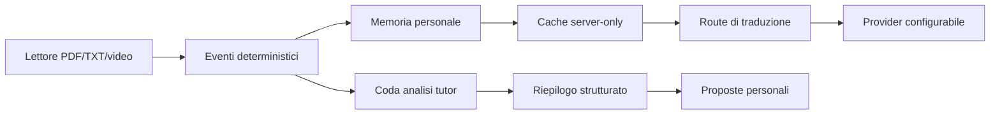

# Traduzione adattiva, Catalogo ed Eve Tutor

L'assistente dell'app si chiama **Eve**. Prima del tutor personale è stato
aggiunto il Catalogo intelligente descritto in `docs/CATALOG.md`: usa fonti
reali dal database e permette un'importazione esplicita nella stanza.

Questo documento descrive l'integrazione incrementale del lettore assistito,
del vocabolario privato e del tutor personale. Il lettore TXT locale è attivo;
il flag `NEXT_PUBLIC_ADAPTIVE_READER_ENABLED` resta riservato alle annotazioni
e alle route di traduzione, che non sono ancora abilitate.

## Architettura

Il browser non modifica `mastery_score` e non scrive nella cache. Le route
server ricavano l'utente dalla sessione, verificano accesso al materiale e
registrano prove verificabili prima di aggiornare lo stato di apprendimento.

## Fasi

1. **Fondazione (implementata)**: migrazione, RLS, preferenze linguistiche,
   tipi, punteggi e ripetizione dilazionata.
2. **Lettore TXT (implementato)**: download privato da Storage, segmentazione,
   token selezionabili, autosalvataggio e ripristino della posizione personale.
3. **Lettore PDF**: PDF.js, text layer e messaggio esplicito per scansioni senza
   testo; nessun OCR nell'MVP.
4. **Traduzione (implementata, attivazione separata)**: Zod, autenticazione,
   memoria, cache, router Luna/Terra, limiti, Responses API e output strutturato.
5. **Vocabolario**: pagina privata, filtri, correzione, export e ripasso.
6. **Catalogo (implementato)**: fonti reali, ricerca assistita da Eve, percorsi
   privati e importazione esplicita in stanza.
7. **Eve Tutor**: analisi a fine sessione/checkpoint, consigli e accettazione
   esplicita prima di creare task o importare materiali.
8. **Video e laboratorio**: player interno con eventi aggregati; editor ed
   esecuzione isolata. Nessun invio continuo di click o caratteri all'AI.

## Mastery deterministico

I pesi sono centralizzati in `src/lib/vocabulary/vocabulary-config.ts`. Il
punteggio e limitato a 0-100, ma le soglie da sole non bastano: gli stati
`PROBABLY_KNOWN` e `MASTERED` richiedono esposizioni in giorni e contesti
diversi, verifiche corrette e assenza di fallimenti recenti. Un errore su una
voce `MASTERED` la riporta in `NEEDS_REVIEW`.

Intervalli iniziali: 1, 3, 7, 14 e 30 giorni in base allo stato. L'algoritmo e
isolato per consentire una futura sostituzione con SM-2 o FSRS.

## Privacy e costi

- vocabolario, occorrenze, review e analisi del tutor sono private;
- non entrano in chat, attivita recente o riepiloghi condivisi;
- memoria e cache vengono consultate prima di un provider;
- al provider viene inviata soltanto la frase necessaria;
- il monitoraggio e deterministico, le analisi AI avvengono a checkpoint;
- modelli, prezzi, limiti e provider sono configurazione server-side;
- le chiavi non devono mai avere il prefisso `NEXT_PUBLIC_`.

## Lettore TXT

I file `.txt` caricati nei materiali si aprono nella route
`/room/[roomId]/material/[materialId]`. Il browser scarica il file direttamente
dal bucket privato dopo la verifica RLS; non crea un URL pubblico e non invia il
testo a provider esterni. Per evitare blocchi su telefono, il rendering interno
è limitato a 2 MiB per file.

La tabella `material_reader_progress` conserva soltanto paragrafo, token e
percentuale di scorrimento. Il record appartiene all'utente autenticato ed è
accessibile solo finché fa parte della stanza. Il salvataggio avviene ogni otto
secondi e quando la pagina viene nascosta. Una chiamata può partire soltanto
dopo un'azione esplicita nel popover; con il provider disattivato non viene
generato alcun costo.

## Traduzione contestuale e router

`POST /api/translation/translate` verifica la sessione e il materiale tramite
RLS, scarica il TXT privato e controlla che la frase ricevuta esista davvero nel
file. Poi cerca la memoria personale e `translation_cache`; soltanto un miss può
prenotare atomicamente una richiesta a pagamento.

Il router è deterministico: Luna gestisce il percorso breve/economico, Terra le
richieste ambigue o didattiche. Sol non è mai un modello eseguibile nella route
normale e il provider lo rifiuta esplicitamente. Il suo eventuale consiglio
restituisce `confirmation_required`; esecuzione e consenso monouso arriveranno
in una fase separata. Con `TRANSLATION_AI_ENABLED=false` memoria e cache restano
consultabili, ma non parte alcuna chiamata esterna.

## Strategia PDF, video e codice

Il PDF conserva pagina, ordine e posizione dei token senza modificare il file.
Per i video il player registra copertura reale, pause, seek, segmenti rivisti,
note e quiz; il completamento non dimostra da solo la comprensione. Il codice
utente verra eseguito soltanto in browser sandbox o container isolati, mai nel
processo principale Next.js.
