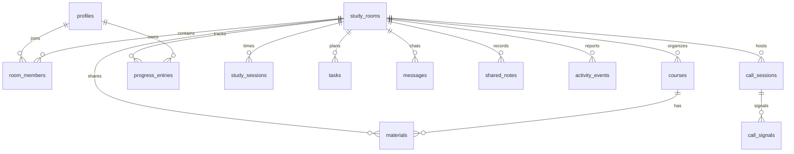

# Architettura dell'MVP

## Struttura delle cartelle

```text
src/
  app/                       pagine App Router e route API
    api/webhooks/study-update/
    dashboard/
    login/ register/
    room/[roomId]/
  components/                UI riusabile e dashboard stanza
  hooks/                     Realtime, Presence e autosalvataggio
  lib/
    supabase/                client browser/server e sessione
    webhook/                 validazione, firma, deduplica e processing
    server/                  dipendenze solo server
supabase/
  migrations/                schema e policy RLS versionate
  seed.sql                   dati facoltativi per sviluppo
tests/                       webhook, sincronizzazione e dominio
docs/                        decisioni tecniche e schema dati
```

## Schema dati

Le entita condivise hanno `room_id`; l'accesso parte sempre da `room_members`. `profiles`
estende `auth.users`. Corsi, materiali, progressi, sessioni, attivita, messaggi, note e
segnali WebRTC non impongono un limite di due utenti. Vincoli, enum e trigger proteggono
gli invarianti anche se il client e' compromesso.



## Flusso degli eventi

1. Una mutazione viene validata dal client e scritta in PostgreSQL con il JWT utente.
2. PostgreSQL applica vincoli e RLS e assegna il timestamp del server.
3. Realtime pubblica il cambiamento ai membri collegati.
4. Ogni client deduplica per id/versione, aggiorna lo stato locale e riconcilia al reconnect.
5. Presence segnala soltanto la connessione; stato e attività canonici arrivano dalla
   tabella `presence`, aggiornata da heartbeat RPC autenticati con timestamp server.
6. L'autosalvataggio periodico e `sendBeacon` inviano il riepilogo senza dipendere solo da
   `beforeunload`.

Il webhook e' un ingresso separato: raw body -> rate limit -> HMAC -> Zod -> insert
idempotente in `webhook_events` -> risposta `202` -> elaborazione breve/deferita.

## Modello di autorizzazione

- `auth.uid()` e' la sola identita attendibile per le operazioni browser.
- Le funzioni helper RLS controllano membership senza policy ricorsive.
- Un membro legge i dati condivisi della stanza; scrive solo cio' che il suo ruolo consente.
- Profili, note private, ricevute, sessioni e progressi personali hanno controlli di proprieta'.
- Proprietario/moderatore gestisce inviti, membri e cancellazione stanza.
- Il webhook usa una chiave server e puo' scrivere solo dopo firma valida; la secret key non
  entra mai nel bundle client.
- Storage accetta solo file nel percorso `<roomId>/<userId>/...` se l'utente e' membro.

## Rischi principali e mitigazioni

| Rischio | Mitigazione MVP |
| --- | --- |
| Policy RLS ricorsive o troppo larghe | helper `security definer`, search path fissato e test con utente estraneo |
| Timer alterato dal browser | `started_at/paused_at/ended_at` e calcolo SQL da timestamp server |
| Dati persi chiudendo la pagina | autosave, salvataggio su transizioni e beacon come ultima rete |
| Duplicati/conflitti Realtime | id eventi, `updated_at`, upsert e riconciliazione dopo reconnect |
| Presenza instabile | heartbeat moderato e finestra di tolleranza prima di mostrare offline |
| Spam/chat o webhook | limiti di lunghezza, intervallo minimo e rate limit |
| File malevoli | allowlist MIME, 10 MB, nomi casuali, bucket privato e download firmati |
| Limite in-memory del rate limiter serverless | adeguato solo in locale; Redis/Upstash previsto in produzione |
| Chiamata WebRTC | solo signaling MVP; media sempre dietro consenso esplicito in fase 4 |

## Confine dell'MVP

Operativo: auth, stanze, membership, presenza, progressi, chat, timer, checklist, materiali,
note, attivita, riepilogo, webhook firmato e signaling preparatorio. Rimandati: media WebRTC,
TURN gestito, screen sharing, provider AI, notifiche push e rate limiter distribuito.
