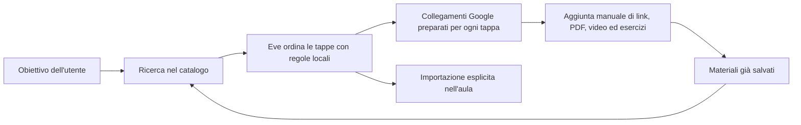

# Catalogo ed Eve

Il Catalogo viene prima del Tutor AI: raccoglie materiali reali e permette di
trasformarli in un percorso importabile in una stanza. L'assistente si chiama
**Eve**, ma in questa sezione funziona con regole locali e non chiama OpenAI.

## Flusso attuale



La barra principale offre due azioni:

- **Cerca nel catalogo** trova e ordina esclusivamente materiali già salvati;
- **Cerca percorso su Google** apre una ricerca didattica già composta, dalle
  basi al livello desiderato, con corsi, video, PDF ed esercizi.

Ogni tappa suggerita da Eve contiene inoltre collegamenti Google distinti per
lezioni, esercizi con soluzioni, video e PDF. L'app prepara le parole chiave ma
non legge, copia o importa automaticamente i risultati di Google.

## Ampliare il catalogo

Con **Aggiungi materiale** l'utente può salvare un collegamento a una pagina,
un PDF, un documento, un dataset, un notebook, un archivio, un video, un corso,
un libro o un podcast. Titolo e URL HTTPS sono obbligatori; fonte, descrizione e
lingua possono essere specificati dall'utente.

Le nuove risorse:

- sono deduplicate per URL;
- vengono salvate come `pending` e `community`;
- restano visibili nel catalogo personale dell'autore;
- possono essere selezionate per un percorso o importate in una stanza;
- non vengono scaricate automaticamente;
- non possono usare reti private, URL non HTTPS o formati eseguibili.

## Percorsi

### Pacchetto Programmazione da zero

`src/lib/catalog/subjects/programming.ts` contiene il primo `SubjectPackage`
editoriale. Il registry in `src/lib/catalog/subjects/registry.ts` lo risolve
prima dei vecchi blueprint quando la richiesta contiene `programmazione`,
`coding`, `software development`, `python` o gli altri alias dichiarati.

Il pacchetto contiene 14 tappe numerate da 0 a 13, con prerequisiti, concetti,
obiettivi, lezioni, attività, esercizi, progetto, criteri di completamento e
otto ricerche Google mirate per tappa (quattro categorie, italiano e inglese).
Il livello iniziale decide la prima tappa, le ore settimanali stimano la durata,
mentre il traguardo resta il progetto finale verificabile.

La migrazione `0013_programming_subject_package.sql` registra 12 fonti curate e
aggiunge metadati ordinati a moduli e task. L'importazione crea il corso
`Programmazione da zero`, aggiunge soltanto fonti verificate e crea quattro task
per tappa: lezione, esercizio, progetto e verifica. La coppia percorso/aula è
unica, quindi una seconda importazione non duplica corso, materiali o checklist.

Eve crea un percorso deterministico usando la richiesta, la tassonomia e i
materiali pertinenti disponibili. L'utente può selezionare manualmente i
materiali, scegliere livello iniziale, obiettivo e ore settimanali, salvare il
percorso e importarlo in una stanza come corso, materiali e checklist.

La ricerca e la creazione dei percorsi del Catalogo non invocano API AI e non
consumano credito OpenAI. Le vecchie variabili Eve restano disattivate anche se
fossero ancora configurate nell'ambiente di produzione.

## Variabili

```env
NEXT_PUBLIC_CATALOG_ENABLED=1
CATALOG_ENABLED=true
EVE_CATALOG_ENABLED=false
EVE_WEB_SEARCH_ENABLED=false
EVE_AUTOMATIC_CURRICULUM_ENABLED=false
EVE_PATH_AI_ENABLED=false
```

`OPENAI_API_KEY` può ancora essere usata da altre funzioni separate dell'app,
come la traduzione, ma non viene letta dalle route di ricerca e percorso del
Catalogo.

## Privacy

Ricerche, preferenze, materiali personali e percorsi appartengono al singolo
utente. L'altro partecipante vede soltanto ciò che viene importato
esplicitamente nella stanza.
