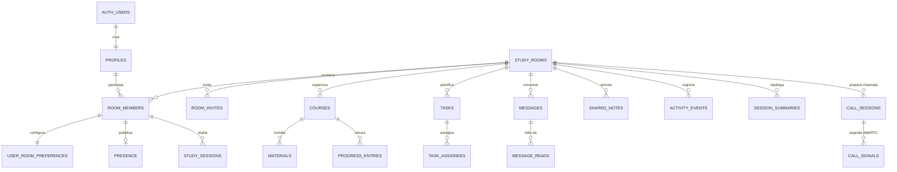

# Database e sicurezza

Questa cartella contiene il modello PostgreSQL/Supabase dell'MVP. Le migrazioni
sono pensate per un progetto Supabase nuovo e devono essere applicate nell'ordine:

1. `0001_initial_schema.sql`: tipi, tabelle, vincoli, indici, trigger e RPC;
2. `0002_rls_policies.sql`: RLS, privilegi, Storage e publication Realtime;
3. `0003_fix_join_room_ambiguous_room_id.sql`: correzione della RPC inviti;
4. `0004_audio_calls.sql`: partecipanti e RPC delle chiamate audio;
5. `0005_keep_call_updates_visible.sql`: visibilita degli aggiornamenti finali;
6. `0006_adaptive_vocabulary_foundation.sql`: vocabolario privato, preferenze,
   prove di apprendimento e cache server-only;
7. `0007_material_reader_progress.sql`: posizione privata nel lettore TXT;
8. `0008_ai_translation_execution.sql`: consumi AI, consensi avanzati e
   prenotazione atomica delle richieste;
9. `../supabase/seed.sql`: dati locali facoltativi, mai in produzione.

## Modello dati

Il modello non contiene alcun limite a due partecipanti. La relazione
`room_members` permette un numero arbitrario di utenti per stanza; l'interfaccia
MVP può comunque ottimizzare l'esperienza per due persone.



### Tabelle principali

| Tabella | Scopo e decisioni importanti |
|---|---|
| `profiles` | Profilo pubblico minimo collegato a `auth.users`; viene creato da trigger. |
| `study_rooms` | Stanza, proprietario storico e codice invito corrente. `deleted_at` disabilita l'accesso. |
| `room_members` | Membership multiutente con ruolo e `left_at` per conservare la storia senza mantenere l'accesso. |
| `user_room_preferences` | Preferenze private per stanza: presenza, attività e note private predefinite. |
| `room_invites` | Storico revocabile. Salva SHA-256 normalizzato, prefisso, scadenza, usi e revoca; non salva i codici storici in chiaro. |
| `presence` | Stato/attività canonici e heartbeat persistiti; Realtime Presence segnala soltanto la connessione. |
| `courses`, `materials` | Corsi e risorse. I file sono riferiti con `storage_path`; gli URL ammessi sono solo HTTP(S). |
| `progress_entries` | Una fotografia corrente per utente/corso; l'unicità è `(room_id,user_id,course_id)`. |
| `study_sessions` | Timer server-authoritative, revisione autosave e JSON di riepilogo in corso. |
| `tasks`, `task_assignees` | Checklist condivisa. `everyone`, `single` e `selected` funzionano anche oltre due utenti. |
| `messages`, `message_reads` | Chat deduplicata da `client_id`, limite 2.000 caratteri e ricevute di lettura. |
| `shared_notes` | Note `shared` oppure `private`; una nota privata è leggibile solo dall'autore. |
| `activity_events` | Feed append-only. La preferenza `share_activity=false` nasconde agli altri gli eventi dell'utente. |
| `session_summaries` | Riepilogo finale strutturato per uscita, esportazione e testo “per Tatiana”. |
| `webhook_events` | Inbox idempotente: `event_id` è la chiave primaria. Nessun accesso client autenticato. |
| `call_sessions`, `call_signals` | Segnalazione WebRTC futura; nessun media viene acquisito dal database. |
| `user_language_preferences` | Lingue, modalita annotazioni e consenso AI globale dell'utente. |
| `user_vocabulary` | Voci e significati privati con mastery deterministico. |
| `vocabulary_occurrences`, `vocabulary_reviews` | Esposizioni e verifiche private, collegate al proprietario. |
| `vocabulary_learning_events` | Prove append-only usate per rendere verificabili gli aggiornamenti. |
| `translation_cache` | Cache condivisa ma accessibile soltanto alle route server-side. |

Le chiavi esterne composite stanza/utente e stanza/corso impediscono di associare
accidentalmente un dato a un utente, corso o materiale appartenente a un'altra
stanza. I campi JSON hanno un vincolo `object`; testo, percentuali, punteggi e
conteggi hanno limiti nel database oltre alla validazione Zod dell'app.

## RPC applicative

Le funzioni esposte a `authenticated` ricavano sempre l'identità da `auth.uid()`.
Nessuna accetta un `user_id` scelto dal browser.

| RPC | Risultato |
|---|---|
| `create_study_room(room_name)` | Crea stanza, owner, preferenze e invito in una transazione; restituisce `id`, `name`, `invite_code`. |
| `join_study_room(invite_code)` | Blocca atomicamente l'invito, verifica revoca/scadenza/usi, riattiva la membership e restituisce `room_id`. |
| `leave_study_room(room_id)` | Marca presenza offline e membership uscita; trasferisce l'ownership al membro attivo più anziano oppure archivia una stanza rimasta vuota. |
| `rotate_room_invite(p_room_id)` | Solo owner: revoca il codice precedente e restituisce quello nuovo. |
| `rotate_study_room_invite(p_room_id,p_expires_at,p_max_uses)` | Variante amministrativa con scadenza e numero massimo di usi. |
| `revoke_study_room_invite(p_room_id)` | Revoca immediata di tutti gli inviti attivi della stanza. |
| `touch_presence(p_room_id,p_status,p_current_activity,p_device_label)` | Upsert heartbeat usando timestamp server. |
| `mark_presence_left(p_room_id)` | Stato offline persistito; integra `sendBeacon` ma non sostituisce l'heartbeat. |
| `set_presence_sharing(p_room_id,p_enabled)` | Interrompe/riprende la condivisione dello stato. |
| `start_study_session(p_room_id,p_mode default 'free')` | Avvia un timer libero o `pomodoro_focus`; un solo timer aperto per utente/stanza. |
| `pause_study_session(p_session_id)` | Accumula sul server il segmento trascorso e mette in pausa. |
| `resume_study_session(p_session_id)` | Apre un nuovo segmento usando `clock_timestamp()`. |
| `autosave_study_session(p_session_id,p_revision,p_summary)` | Salva solo revisioni crescenti; replay e beacon fuori ordine non sovrascrivono dati nuovi. |
| `complete_study_session(p_session_id)` | Materializza il tempo residuo, crea/aggiorna `session_summaries` e chiude definitivamente la sessione. |
| `prepare_account_deletion()` | Preflight autenticato e non distruttivo prima della Admin Auth API. |
| `prepare_study_room_deletion(p_room_id)` | Solo owner; applica un tombstone idempotente e revoca gli inviti, bloccando nuove letture/scritture mentre il server elimina ricorsivamente i file. |
| `delete_study_room(p_room_id)` | Solo owner, anche dopo il tombstone; cancella hard la stanza con cascade DB. I retry dopo il successo sono no-op. |

Tutte le RPC `SECURITY DEFINER` impostano un `search_path` vuoto, usano nomi
schema-qualified e hanno `EXECUTE` revocato a `PUBLIC`. Gli helper RLS
`is_room_member`, `is_room_admin`, `is_room_owner`, `shares_room_with`,
`activity_is_shared` e `is_task_manager` interrogano le tabelle come proprietario
della migrazione: questo evita ricorsione RLS senza fidarsi di identificativi
forniti dal client.

## Timer e autosalvataggio

`total_seconds` contiene solo tempo già materializzato. Quando `status=running`,
il valore visualizzato è:

```text
total_seconds + floor(server_now - last_resumed_at)
```

Il trigger `study_sessions_server_clock` ignora timestamp e contatori proposti dal
browser, accetta soltanto transizioni valide e calcola pause/completamento con
`clock_timestamp()`. Le API dovrebbero preferire le quattro RPC del timer.

`client_revision` parte da zero. Ogni autosave invia una revisione maggiore e un
oggetto `summary_data` (massimo 32 KiB). Una revisione uguale o minore restituisce
lo stato corrente senza scrivere: retry, doppio `sendBeacon` e riconnessioni sono
quindi idempotenti. `last_autosaved_at` usa sempre l'orologio del database. Se il
JSON contiene `final:true`, la stessa transazione completa il timer con l'orologio
server e fa upsert del riepilogo finale. Anche `complete_study_session` riusa questo
ramo, quindi lo Stop esplicito e il page-leave producono lo stesso risultato.

Il JSON può conservare elenchi, per esempio i titoli delle lezioni concluse. La
tabella `session_summaries` conserva invece i relativi conteggi finali
(`lessons_completed`, `exercises_completed`) e gli altri campi richiesti da
`user_left_room`.

## Presenza

Valori persistiti:

- `online` → online;
- `studying` → sta studiando;
- `break` → in pausa;
- `away` → assente;
- `in_call` → in chiamata;
- `offline` → non connesso.

La tabella `presence` è la fonte autorevole per stato, attività, privacy e
`last_seen_at`. Presence di Supabase è soltanto un indizio effimero di
connessione/disconnessione e non sovrascrive da solo lo stato persistito.
`touch_presence` aggiorna l'heartbeat server-side; il client applica una finestra di tolleranza
prima di mostrare offline, così una perdita breve di rete non produce falsi leave.
`device_label` è una stringa volontaria e generica (“Computer”, “Telefono”), non
un user-agent o fingerprint. Quando `share_presence=false`, la policy RLS rende la
riga invisibile agli altri partecipanti pur lasciandola accessibile all'utente.

## Autorizzazione RLS

Tutte le tabelle pubbliche hanno RLS attiva. In sintesi:

| Risorsa | Lettura | Scrittura |
|---|---|---|
| Profilo | sé o partecipante di una stanza condivisa | solo sé |
| Stanza/membri | membro attivo | mutazioni membership via RPC; nome da admin |
| Preferenze | soltanto proprietario della preferenza | soltanto proprietario attivo |
| Inviti | admin della stanza | rotazione/revoca via RPC |
| Presenza | membro; riga altrui solo se condivisa | propria, normalmente via RPC |
| Corsi/materiali | membro | creatore o admin |
| Progressi/sessioni | membro | soltanto proprietario; timer via RPC |
| Checklist | membro | membri; cancellazione da creatore/admin |
| Chat/ricevute | membro | mittente/proprietario della ricevuta |
| Note | condivise ai membri, private solo all'autore | soltanto autore |
| Attività | membro, salvo opt-out dell'attore | evento proprio o backend |
| Webhook inbox | nessuna policy client | esclusivamente service role server-side |
| Chiamate/segnali | membro/partecipante destinatario | membro autenticato della stanza |

I grant di colonna impediscono di modificare dal client chiavi primarie,
`created_by`, timestamp e campi del cronometro. La chiave service role non deve
mai essere inclusa in variabili `NEXT_PUBLIC_*` né inviata al browser.

### Verifica manuale RLS

In SQL Editor è possibile simulare un JWT dopo aver sostituito gli UUID:

```sql
set local role authenticated;
set local request.jwt.claim.sub = '10000000-0000-0000-0000-000000000001';
select * from public.study_rooms;
select * from public.shared_notes;
reset role;
```

Ripetere con un terzo utente non membro: le query di stanza devono restituire zero
righe e insert/update devono essere respinti.

## Storage

La migrazione crea il bucket privato `study-materials` con limite di 10 MiB e una
allowlist MIME per PDF, testo, immagini e documenti da studio. Il percorso è parte
del modello di sicurezza:

```text
<room_uuid>/<uploader_uuid>/<uuid-casuale>-<nome-sanitizzato>
```

- lettura: qualsiasi membro attivo della stanza;
- upload: membro, ma soltanto nella propria cartella;
- sostituzione/cancellazione: owner dell'oggetto oppure admin della stanza;
- link nel frontend: signed URL breve, non URL pubblico permanente.

Il server deve comunque verificare MIME reale/magic bytes, normalizzare il nome e
non fidarsi dell'estensione. Le policy Storage autorizzano il contenitore, mentre
questi controlli applicativi proteggono da file camuffati.

## Realtime

La seconda migrazione aggiunge alla publication `supabase_realtime`:

```text
room_members, user_room_preferences, presence, courses, materials,
progress_entries, study_sessions, tasks, task_assignees, messages,
message_reads, shared_notes, activity_events, session_summaries,
call_sessions, call_signals
```

Le tabelle usano `REPLICA IDENTITY FULL` per fornire la riga precedente negli
UPDATE/DELETE. Il client deve comunque deduplicare per chiave primaria/event ID,
ordinare con i timestamp server e rifare una query canonica dopo una
riconnessione. I filtri Realtime devono includere `room_id=eq.<uuid>`; RLS resta
l'ultima barriera e non va sostituita dal solo filtro del canale.

I topic `room:<uuid>:presence` e `room:<uuid>:database` hanno inoltre policy su
`realtime.messages`: SELECT/INSERT sono concessi soltanto a un membro attivo. Il
client deve aprirli con `config: { private: true }`, chiamare `realtime.setAuth()`
quando necessario e in Dashboard va disattivato **Allow public access**. Le policy
sono applicate solo a Presence/Broadcast; Postgres Changes continua a filtrare
ogni record con le RLS delle tabelle pubbliche.

## Chat e anti-spam

`messages.client_id` rende idempotenti i retry per `(room_id,sender_id,client_id)`.
Il trigger applica due soglie di base per mittente e stanza: 8 messaggi/10 secondi
e 30/minuto. Questi limiti servono contro errori e spam elementare; in produzione
vanno affiancati da rate limiting distribuito nell'API/edge, perché un trigger DB
non limita traffico che viene rifiutato prima dell'insert e non sostituisce una
protezione per IP/account.

Il contenuto è testo semplice e lungo al massimo 2.000 caratteri. Il frontend deve
renderizzarlo come testo; eventuali link vanno riconosciuti e aperti con
`rel="noopener noreferrer"`, senza interpretare HTML utente.

## Webhook inbox

`webhook_events.event_id uuid` è la PK e offre deduplicazione atomica. Gli stati
ammessi sono `received`, `processing`, `processed`, `failed`, `ignored`;
`received_at` usa `clock_timestamp()` se omesso. Eventi ammessi:

```text
session_started, session_paused, session_completed, progress_updated,
exercise_completed, material_opened, note_created, user_left_room
```

La verifica HMAC sul body raw, il confronto timing-safe e il rate limiting restano
nel route server. Solo dopo la verifica il route usa il service role per inserire.
`ON CONFLICT DO NOTHING`/`Prefer: resolution=ignore-duplicates` evita una seconda
elaborazione dello stesso `event_id`. Nei log usare soltanto event ID, stato e
codici d'errore; mai firma, secret o service key.

## Dati demo locali

`supabase/seed.sql` crea:

- `tatiana@example.test` / `StudioDemo123!`;
- `studio@example.test` / `StudioDemo123!`;
- stanza “Aula Python”, codice `STUDY-DEMO-2026`;
- corso, materiale web, progressi, task, chat, ricevute e note shared/private.

Il seed inserisce record in `auth.users` e `auth.identities` secondo lo schema Auth
Supabase corrente. È destinato a `supabase db reset` locale. Se una futura versione
di Supabase cambia le colonne interne di Auth, creare i due utenti dalla UI locale
e mantenere il seed dei soli dati `public`; non adattare alla cieca lo schema
gestito `auth` in produzione.

## Cancellazione, uscita ed esportazione

- `leave_study_room` revoca l'accesso senza cancellare immediatamente la storia.
- La cancellazione completa della stanza deve essere orchestrata da un route
  server owner-only: raccoglie/rimuove gli oggetti con Storage API e chiama
  `delete_study_room`; le FK `ON DELETE CASCADE` eliminano i record pubblici. Se
  l'ordine viene invertito, il service client può comunque rimuovere i blob ma
  deve conservare prima l'elenco dei path.
- L'eliminazione account chiama prima il preflight read-only
  `prepare_account_deletion()`, quindi Admin Auth `deleteUser`. I FK fanno `SET
  NULL` soltanto sulla colonna autore e il trigger di membership trasferisce owner
  o archivia la stanza nella stessa transazione del cascade. I path Storage vanno
  raccolti prima e rimossi con Storage API dopo il successo, con retry.
- L'esportazione personale usa query autenticata su progressi, sessioni, note
  private e riepiloghi dell'utente; non richiede service role.

## Catalogo e percorsi privati

La migrazione `0009_intelligent_catalog.sql` aggiunge `catalog_topics`,
`catalog_materials`, `catalog_material_topics`, `saved_catalog_materials`,
`user_learning_preferences`, `catalog_searches`, `learning_paths`,
`learning_path_modules`, `learning_path_items` e
`learning_path_room_imports`. Il catalogo attivo è leggibile dagli utenti
autenticati; ricerche, preferenze, salvataggi e percorsi sono invece isolati per
proprietario tramite RLS. Le RPC di importazione verificano `auth.uid()` e la
membership della stanza, e non si fidano di un `userId` inviato dal browser.

La migrazione `0013_programming_subject_package.sql` aggiunge `stage_id` e
metadati editoriali ai moduli, oltre a `learning_path_id`, tipo, ordine, criteri
e durata stimata ai task. Registra le fonti curate di Programmazione e aggiorna
le RPC: il salvataggio conserva la struttura del pacchetto e l'importazione
percorso/aula rimane idempotente e produce checklist semanticamente distinte.

## Assunzioni e rischi residui

1. Le migrazioni richiedono Supabase/PostgreSQL moderno, schema `auth`, schema
   `storage` e ruolo `authenticated`. Su PostgreSQL puro, la parte Storage/Auth va
   omessa o sostituita.
2. Le policy Storage usano `storage.objects.owner_id` testuale, come nelle versioni
   Supabase correnti. Verificare questa colonna dopo aggiornamenti Storage.
3. `study_rooms.invite_code` conserva in chiaro soltanto il codice corrente, perché
   l'owner deve poterlo copiare. RLS lo mostra esclusivamente ai membri; lo storico
   conserva solo hash. Per requisiti più rigidi, restituire il codice una sola volta
   dalla RPC e rimuovere la colonna in chiaro in una migrazione futura.
4. Un invito usa 72 bit casuali. Non va sostituito con codici brevi scelti dagli
   utenti; rate-limitare comunque `join_study_room` a livello edge.
5. La rimozione fisica dei file non è transazionale con PostgreSQL. Il route di
   cancellazione deve registrare retry/cleanup per gli oggetti Storage orfani.
6. Il signaling WebRTC contiene solo SDP/ICE temporanei e scade dopo dieci minuti;
   serve un job periodico per cancellare segnali scaduti. STUN/TURN, consenso media,
   audio/video e screen sharing restano fase 4.
7. CSP, CSRF sui cookie-based route, validazione Zod e verifica magic bytes sono
   controlli applicativi e non possono essere espressi interamente in RLS.

## CORE-1.3 — schema di produzione Eve

La migrazione `0018_eve_core_production_data.sql` introduce il confine persistente di Eve senza attivarlo automaticamente. Le tabelle sono separate per `room_id`, usano chiavi esterne composite quando una relazione attraversa aula, corso, conversazione o materiale, e hanno RLS attiva.

Principi:

- `EVE_PRODUCTION_DATABASE_ENABLED=false` e `EVE_SQLITE_IMPORT_ENABLED=false` per impostazione predefinita;
- import SQLite solo server-side con service role e batch idempotenti;
- `eve_audit_events` append-only;
- import staging non accessibile ad `anon` o `authenticated`;
- conversazioni private al proprietario e alla relativa aula;
- fonti INTELLIGENCE promosse con collegamento esplicito a revisione e materiale;
- nessuna migrazione viene applicata al database remoto dal pacchetto locale;
- rollback distruttivo bloccato finché non viene impostata esplicitamente la variabile di sessione dopo un backup verificato.

Il file `supabase/rollback/0018_eve_core_production_data.down.sql` è un runbook tecnico, non una procedura automatica da eseguire durante il normale deploy.
